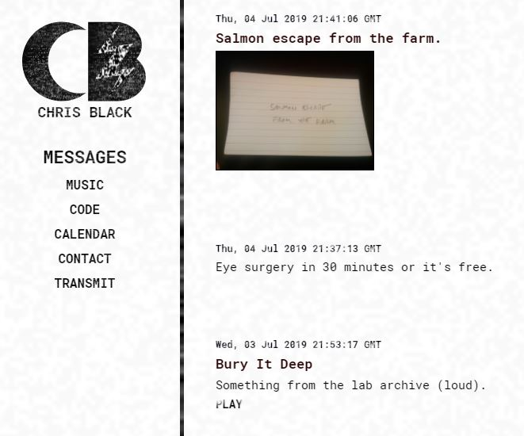

# Transmitter

## A custom CMS built on React and Firebase.

A microblog / music player / code portfolio on the frontend, and a creativity archive manager on the backend. As a musician, web developer, artist, and amusing idiot, I needed a play to store and display my various scraps of ideas, and to sort them for my own review and further development. This is Transmitter.

My own public implementation is at [www.chrisblack.net](https://www.chrisblack.net). Here's what it has:

**Blog.** Post whatever little bits of anything come to mind, from photos to sound files to anecdotes to links to jokes to coding projects and whatever else occurs to you.

- Make the posts public or private.
- On the admin side, filter by post type to review all entries of a certain type ("jokes" or "lyrics" or "images" or what have you).

**Music Player.** I am a musician, so I wanted a custom music player for my work.

- Batch upload your MP3s.
- ID3 tag info extracted and stored in the database for display / filtering.

**Calendar**

- Add pubilc or private events.

**Code Portfolio**

- Any messages of type "code" will be displayed in the /code part of the website, which also has some introductory text.

**Admin Features**

- Sort your posts by post type to see everything of a kind at once, and check out your calendar for your day's tasks.

**Mobile-first.** This app was made for your phone, to transmit your wisdom from anywhere at any time.

## TO-DO

This is a first-draft public deployment of this app, and there is much to do to make it usable and add all the features I intend to add.

1. Documentation! This is the barest documentation possible right now, and there is a lot to add!

2. Blank Slatification! Right now, a lot of my specific content and needs are hard-coded. I'll have to take some time to refactor to make it easier for you to use.

3. Meta tags! I need to install react-helmet.

4. Lazy images! We can't be using up all that free bandwidth on images below the fold.

5. Video! I'd like to add a native video player.

6. Social! I'd like to add the ability to cross-post to Facebook, Twitter, etc.

7. Sticky! Some posts want to be sticky.

# Create React App Boilerplate

## From here on down is the React boilerplate README text, which I have not modified.

This project was bootstrapped with [Create React App](https://github.com/facebook/create-react-app).

## Available Scripts

In the project directory, you can run:

### `npm start`

Runs the app in the development mode. 
Open [http://localhost:3000](http://localhost:3000) to view it in the browser.

The page will reload if you make edits. 
You will also see any lint errors in the console.

### `npm test`

Launches the test runner in the interactive watch mode. 
See the section about [running tests](https://facebook.github.io/create-react-app/docs/running-tests) for more information.

### `npm run build`

Builds the app for production to the `build` folder. 
It correctly bundles React in production mode and optimizes the build for the best performance.

The build is minified and the filenames include the hashes. 
Your app is ready to be deployed!

See the section about [deployment](https://facebook.github.io/create-react-app/docs/deployment) for more information.

### `npm run eject`

**Note: this is a one-way operation. Once you `eject`, you can’t go back!**

If you aren’t satisfied with the build tool and configuration choices, you can `eject` at any time. This command will remove the single build dependency from your project.

Instead, it will copy all the configuration files and the transitive dependencies (Webpack, Babel, ESLint, etc) right into your project so you have full control over them. All of the commands except `eject` will still work, but they will point to the copied scripts so you can tweak them. At this point you’re on your own.

You don’t have to ever use `eject`. The curated feature set is suitable for small and middle deployments, and you shouldn’t feel obligated to use this feature. However we understand that this tool wouldn’t be useful if you couldn’t customize it when you are ready for it.

## Learn More

You can learn more in the [Create React App documentation](https://facebook.github.io/create-react-app/docs/getting-started).

To learn React, check out the [React documentation](https://reactjs.org/).

### Code Splitting

This section has moved here: https://facebook.github.io/create-react-app/docs/code-splitting

### Analyzing the Bundle Size

This section has moved here: https://facebook.github.io/create-react-app/docs/analyzing-the-bundle-size

### Making a Progressive Web App

This section has moved here: https://facebook.github.io/create-react-app/docs/making-a-progressive-web-app

### Advanced Configuration

This section has moved here: https://facebook.github.io/create-react-app/docs/advanced-configuration

### Deployment

This section has moved here: https://facebook.github.io/create-react-app/docs/deployment

### `npm run build` fails to minify

This section has moved here: https://facebook.github.io/create-react-app/docs/troubleshooting#npm-run-build-fails-to-minify
